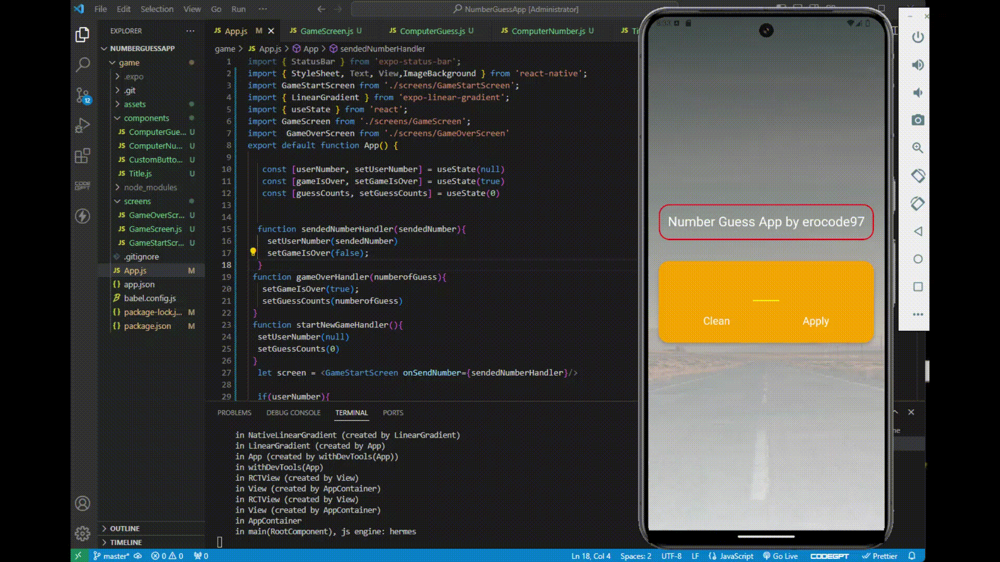

<h1>Introducing the Number Guess App! 🎉</h1>

I am excited to share my latest project, the Number Guess App, a fun and interactive application designed to challenge your number guessing skills. This project was a fantastic journey, encompassing a wide array of features and functionalities that highlight my proficiency in app development. Below are the key steps and components that went into the creation of this app:

->>User-Friendly Game Screen  
->>Custom Buttons and Linear Gradient Backgrounds  
->>Input Validation and Smooth Navigation  
->>Dynamic Title Component  
->>Initial Number Guess by Computer  
->>Increment and Decrement Actions  
->>Game Over Logic  
->>Stylish Game Screen and Game Over Screen  
->>Attempt Count Display  
->>Easy Restart Option  
->>Computer's Guesses Display  

I invite you to explore the Number Guess App and share your thoughts. Your feedback will be invaluable as I continue to refine and improve my skills.  

Thank you for your support!

